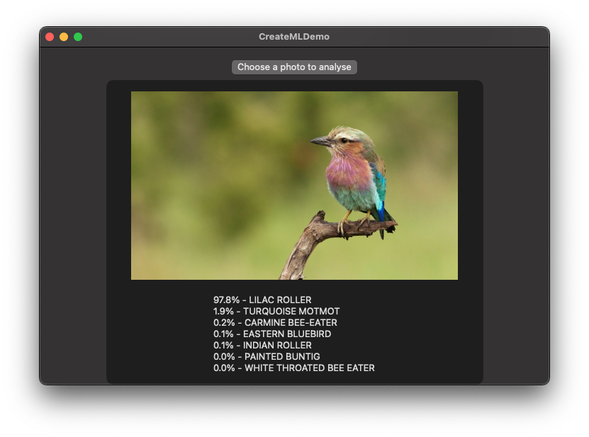

# MacMachineLearningDemo

The mac application of this repository was built to teach myself how to utilise CreateML and Xcode to create machine-learning powerered applications.

The current application has the following features/capabilities.

- Static Image Classification
- Hand Pose Detection and Prediction (including augmentation)

## Bird Species Classification

Using Apple's Create ML application I trained an image classification model using a [dataset of 525 species of birds from Kaggle](https://www.kaggle.com/datasets/gpiosenka/100-bird-species). With the generated `.mlmodel` file, I imported it into Xcode and created a simple program where a user can upload a image to use and the model will produce attempt to predict what species of bird the image contains.

  

## Hand Pose Detection and Prediction

As a part of this project I wanted to learn two things: how to utilse a live camera feed (webcam), and how to perform real-time predictions on the video feed. For myself this meant using a framework I have never used before, [Vision](https://developer.apple.com/documentation/vision/), which is a powerful tool that seems like few people know about. This section of the project uses an ASL (American Sign Language) dataset to produce a hand pose classification ML model. The [dataset containing 26 letters, space, and nothing from Kaggle](https://www.kaggle.com/datasets/grassknoted/asl-alphabet) was used to train the `.mlmodel` that has been imported into the application.

The finalised section of the app has two main features: augmentation of the hand to show an overlay on the camera feed, and live predictions showing the models predictions for each letter.

  

### Notes

For thsoe trying to run the `Hand Pose Identification` I have found that this works best with my M1 MBP. When tested on an 2017-intel MBP predictions were slow and meant the whole program failed to perform as expected.
